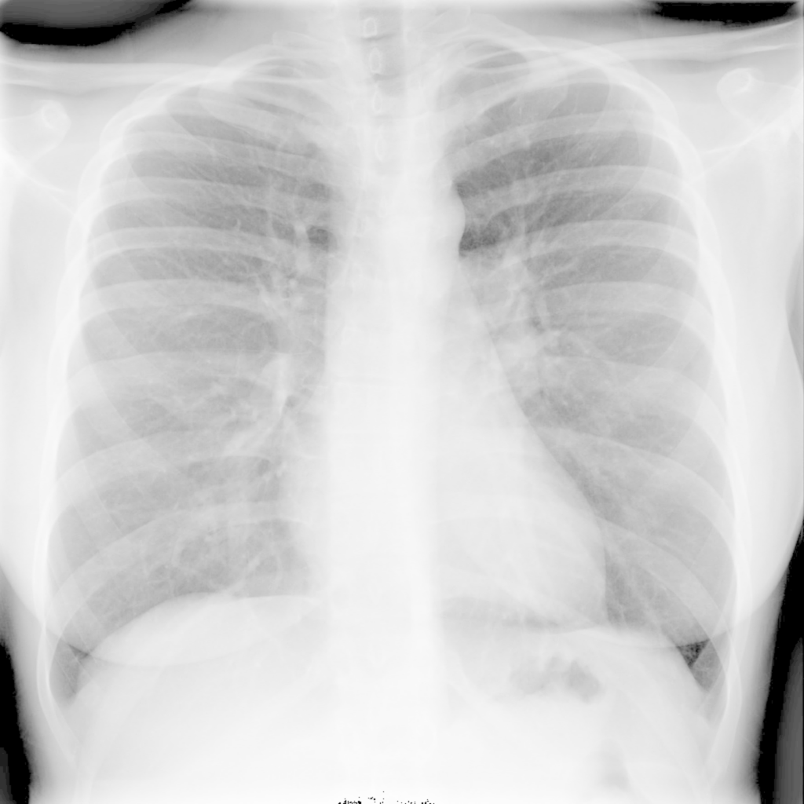
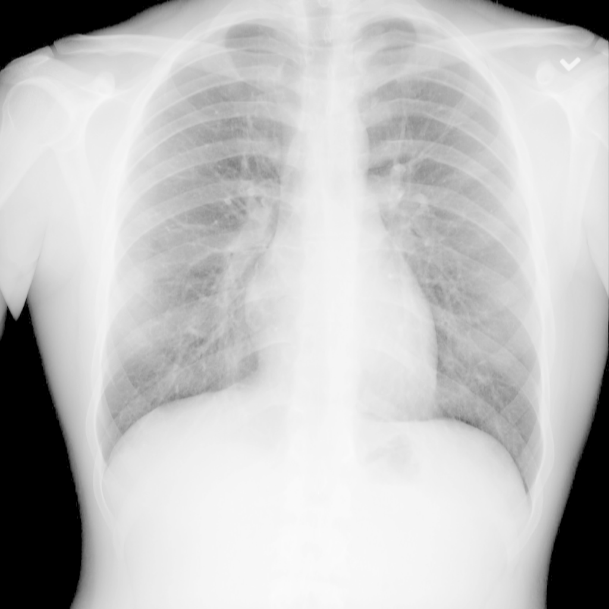

AI-HERO Health Challenge on energy efficient AI - Predicting Covid-19 from chest x-ray images
=============================================================================================

This repository provides the code for the baseline. It contains a full training pipeline in Pytorch including dataloading, training a VGG and evaluating.
You are free to clone this baseline and build on it.
The repository also includes necessary bash scripts for submitting to HAICORE. 

The following sections contain detailed explanations about the structure, how to adapt the templates and how to get going on Haicore.

Table of contents
=================

<!--ts-->
   * [Data](#data)
   * [Structure of the Skeleton Code](#structure-of-the-skeleton-code)
   * [HAICORE Setup](#haicore-setup)
     * [Clone from Github](#clone-the-skeleton-code)
     * [Virtual Environment](#set-up-your-environment)
       * [venv](#venv-allows-python-36-or-38)
       * [conda](#conda-experimental)
   * [Training on HAICORE](#training-on-haicore)
   * [Monitoring Jobs](#useful-commands-for-monitoring-your-jobs-on-haicore)
   * [Test your Submission](#test-the-final-evaluation)
<!--te-->

# Data

The train and validation data is available in the following workspace on the cluster:

    /hkfs/work/workspace/scratch/im9193-health_challenge/data

It consists of chest x-ray images from several hospitals and comes in very different sizes and file formats (jpg and png).

  

Besides the raw images there are also two csv files (train and valid) containing the name of the image with its respective label (positive or negative).
The `CovidImageDataset` class from this repository in `dataset.py` already implements the correct loading of the data.
Test data is not available during the development.
Overall there are 15784 train images and 150 validation images.

# Structure of the skeleton code

The content of the different files is as follows:

- `dataset.py`: Implements a Pytorch Dataset that loads the challenge data
- `model.py`: Implements a VGG network
- `train.py`: Implements a training pipeline
- `run_eval.py`: Implements inference for a given model and saves predictions as csv
- `training`: directory holding bash scripts for submitting on HAICORE, see [Training on HAICORE](#training-on-haicore)
- `evaluation`: directory holding bash scripts for testing the evaluation on HAICORE, see [Test your Submission](#test-the-final-evaluation)

# Haicore Setup

The HAICORE cluster is organized in workspaces. Each group got its own workspace assigned that is named after your group ID (e.g. H1).
In this workspace you will develop your code, create your virtual environment, save models and preprocessed versions of data and so on.
Once you're logged in to HAICORE, your first step is going to your group workspace.
For the following steps please substitute `<YOUR_GROUP_NAME>` by your group ID.

    cd /hkfs/work/workspace/scratch/im9193-<YOUR_GROUP_NAME>

### Clone the skeleton code

Clone this repository to your workspace. 

    cd /hkfs/work/workspace/scratch/im9193-<YOUR_GROUP_NAME>
    git clone https://github.com/Helmholtz-AI-Energy/AI-HERO-Health.git

### Set up your environment

For your virtual environment you can use either venv or conda. Using venv is the standard and recommended way on HAICORE and works most reliably.
However, only python versions 3.6 and 3.8 are pre-installed. If you want to use a different python version you will need to use conda.
Using conda on the cluster is experimental and is therefore at your own risk.
Follow either the venv or the conda instructions to create a virtual environment. Optionally, you can install the requirements.txt from this repo if you want to build on it.

#### venv (allows python 3.6 or 3.8)

	# go to your workspace
	cd /hkfs/work/workspace/scratch/im9193-<YOUR_GROUP_NAME>

	# load python
	module load devel/python/3.8

	# create virtual environment
	python -m venv health_baseline_env
	source health_baseline_env/bin/activate
	pip install -U pip
	pip install -r /hkfs/work/workspace/scratch/im9193-<YOUR_GROUP_NAME>/AI-HERO-Health/requirements.txt
	
#### conda (experimental)

	# load conda module
	source /hkfs/work/workspace/scratch/im9193-conda/conda/etc/profile.d/conda.sh
	
	# create new environment in your workspace (you can specifiy any python version you want)
	conda create --prefix /hkfs/work/workspace/scratch/im9193-<YOUR_GROUP_NAME>/health_baseline_conda_env python==3.8.0
	
	# activate env and install requirements
	conda activate /hkfs/work/workspace/scratch/im9193-<YOUR_GROUP_NAME>/health_baseline_conda_env
	pip install -U pip
	pip install -r /hkfs/work/workspace/scratch/im9193-<YOUR_GROUP_NAME>/AI-HERO-Health/requirements.txt

# Training on HAICORE

Submitting to HAICORE is done via the `sbatch` command. It requires a bash script that will be executed on the GPU nodes.
In the folder `training` you will find the bash script that starts training the baseline model. 
Depending on what virtual environment you chose, you need to use `train.sh` or `train_conda.sh`.
In the script you also see the defined sbatch flags. Except for the `--partition=haicore-gpu4` flag (this partition is reserved for the hackathon, on other partitions your jobs would be pending)
you can adapt all other flags if you want. Find more information about `sbatch` here: https://slurm.schedmd.com/sbatch.html.

In the script you need to adapt the path to your group workspace in lines 11 and 16.

    cd /hkfs/work/workspace/scratch/im9193-<YOUR_GROUP_NAME>/AI-HERO-Health
    sbatch training/train.sh

# Useful commands for monitoring your jobs on HAICORE

List your active jobs and check their status, time and nodes:

    squeue

A more extensive list of all your jobs in a specified time frame, including the consumed energy per job:

    sacct --format User,Account,JobID,JobName,ConsumedEnergy,NodeList,Elapsed,State -S 2022-02-0108:00:00 -E 2022-02-0314:00:00

Print the sum of your overall consumed energy (fill in your user ID):

    sacct -X -o ConsumedEnergy --starttime 2022-02-0108:00:00 --endtime 2022-02-0314:00:00 --user <YOUR USER ID> |awk '{sum+=$1} END {print sum}'

Open a new bash shell on the node your job is running on and use regular Linux commands for monitoring:

    srun --jobid <YOUR JOB ID> --overlap --pty /bin/bash
    htop
    watch -n 0.1 nvidia-smi
    exit  # return to the regular Haicore environment

Cancel / kill a job:
    
    scancel <YOUR JOB ID>

Find more information here: https://wiki.bwhpc.de/e/BwForCluster_JUSTUS_2_Slurm_HOWTO#How_to_view_information_about_submitted_jobs.3F

# Test the final Evaluation

The final ranking depends on the consumed energy for development as well as running inference and additionally on the Accuracy on the test set.
You can have a look at the calculation of the ranks in `ranking.py`, however, it is not needed in your final repository.
In order to allow us to run your model on the test set, you need to adapt the evaluation files from this repository.
The most important one is `run_eval.py`. It will load your model, run inference and save the predictions as a csv.
It is in your responsibility that this file loads the model and weights you intend to submit. 
You can test the script by just running it, it will automatically predict on the validation set during the development.
In the folder `evaluation` you find the corresponding bash scripts `eval.sh` or `eval_conda.sh` to be able to test the evaluation on HAICORE like this:
    
    cd /hkfs/work/workspace/scratch/im9193-<YOUR_GROUP_NAME>/AI-HERO-Health
    sbatch evaluation/eval.sh

In the bash scripts you again need to adapt the paths to your workspace and also insert the correct model weights path.

After the csv is created, the Accuracy is calculated using `calc_score.py`, which again will use the validation set during development.
You do not need to adapt this file, for evaluating on the test set the organizers will use their own copy of this file.
Nevertheless you can test if your created csv works by running the appropriate bash script:

     sbatch evaluation/score_group.sh

For that you need to adapt the group workspace in lines 9 and 11.

For calculating the groups' final scores the mentioned files need to work. That means, that your workspace needs to contain the virtual environment that is loaded, the code as well as model weights.
To make the submission FAIR you additionally have to provide your code on Github (with a requirements file that reproduces your full environment), and your weights uploaded to Zenodo.
You can complete your submission here: https://ai-hero-hackathon.de/.
We will verify your results by also downloading everything from Github and Zenodo to a clean new workspace and check whether the results match.
